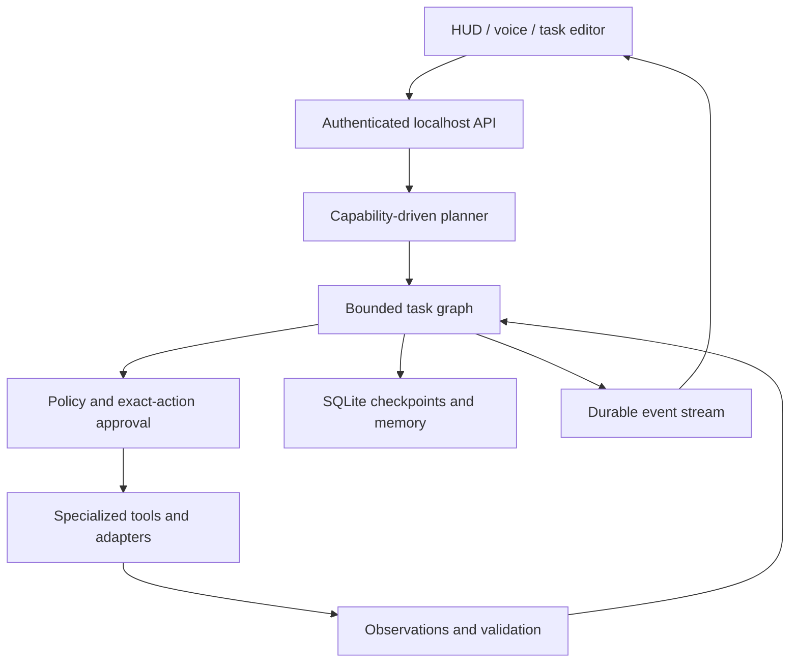

# JARVIS AI

**A local-first personal AI runtime with governed tools, persistent memory, and inspectable execution.**

[Download the preview](https://github.com/Prajwal-Pratap-Yadav/JarvisAI/releases) · [First run](docs/getting-started.md) · [Architecture](docs/architecture.md) · [Developer guide](docs/development.md) · [Security](docs/security.md)

JARVIS turns a goal into a bounded task graph, executes available capabilities, records observations, and checks the results. Its original mission-control interface shows what the runtime is actually doing: active agents, dependencies, approvals, machine telemetry, and a replayable event timeline.

**v0.1.0 is an engineering preview.** It is a practical agentic assistant framework with AGI-oriented research goals, not demonstrated AGI and not an autonomous replacement for human judgment. [Implementation status](docs/status.md) distinguishes working code, optional adapters, verification limits, and future research.

## Start here

**Windows users:** download `Jarvis-0.1.0-Windows-x64.zip` when available under Releases, extract the entire archive, and open `JarvisAI.exe`. The console prints a private local launch link and opens the HUD. Keep the console open while using Jarvis; Ctrl+C stops it. A missing artifact means that target has not passed its release build—do not substitute another OS's binary.

**Python users (3.11+):** download the wheel from Releases and install it with `python -m pip install <downloaded-wheel>`, then run `jarvis`. For development:

```bash
git clone https://github.com/Prajwal-Pratap-Yadav/JarvisAI.git
cd JarvisAI
python -m venv .venv
# Windows PowerShell: .venv\Scripts\Activate.ps1
# Linux/macOS: source .venv/bin/activate
python -m pip install -r requirements.lock
python -m pip install -e .
jarvis
```

No cloud key is needed for the offline tools. In Settings, select Ollama and an **already downloaded** model (the original `phi3:mini` default is retained), or configure an OpenAI-compatible provider. JARVIS does not silently download model weights or switch to a paid provider. [Configuration](docs/configuration.md) covers URLs, environment variables, privacy, and optional adapters.

## What works

- **Real task graphs:** dependencies, concurrent independent nodes, priorities, result references, deadlines, cancellation, bounded retries, failed-dependency propagation, and SQLite checkpoints.
- **Governed tools:** 21 discoverable tools, typed inputs, output contracts, risk metadata, and single-use approval tied to the exact action. File writes use expected hashes and verify their bytes afterward.
- **Inspectable execution:** cognitive stages, active-agent indicator, live telemetry, approvals, per-node results, timing, and durable event replay. No fabricated activity or metrics.
- **Memory you control:** bounded ephemeral conversation context; persistent episodic, semantic, procedural, task, and preference records; provenance, confidence, deduplication, updates, and deletion. Default retrieval uses local lexical cosine similarity.
- **Model adapters:** Ollama and OpenAI-compatible text/image interfaces; optional embedding interface. No model is bundled.
- **Research:** explicit source URLs or optional Brave Search, three concurrent fetches, evidence provenance, partial-failure handling, model-assisted synthesis with uncertainty instructions, and honest offline evidence compilation.
- **Coding:** workspace listing, text search, reads, hash-checked writes, Git inspection, and approved test execution. No general shell tool.
- **Optional multimodal tools:** browser speech recognition/TTS and microphone waveform; screenshot, OCR, visual-model, desktop-input, and isolated Playwright adapters. See the individual guides for requirements and limits.
- **Reminders and observation:** durable recurring reminders, file-change and process-completion watches, and optional rate-limited memory-pressure alerts.

## A real offline demo

```bash
jarvis doctor
jarvis demo
```

`demo` measures the host, inspects the workspace, and checks policy in a real task graph. It exits unsuccessfully if any required node fails. In the HUD, click **Run system briefing**, then inspect each result. Other offline commands are `list files`, `security policy`, `remembered <query>`, and `research <question> <https source URLs>`.

The **Task editor** supports precise workflows without an LLM. Example: create a report from retrieved evidence, with the final write requiring approval:

```json
{
  "goal": "Compile a Python documentation report",
  "nodes": [
    {"id":"source","tool":"web.read","arguments":{"url":"https://docs.python.org/3/"}},
    {"id":"report","tool":"knowledge.report","dependencies":["source"],"arguments":{"title":"Python documentation","evidence":[{"$ref":"source"}]}},
    {"id":"save","tool":"files.write","dependencies":["report"],"arguments":{"path":"reports/python.md","content":{"$ref":"report.content"}},"expect":{"field":"verified","equals":true}}
  ]
}
```

## Architecture



These agents are **role contracts over tools and orchestration**, not independent autonomous processes. No recursive agent conversations occur. [Agent contracts](docs/agents.md) and [cognition](docs/cognition.md) explain the boundaries.

## Trust and verification

The server binds to `127.0.0.1`, requires a generated token, rejects foreign Host/Origin headers, and authenticates WebSockets before sending data. Network fetches use exact-host allowlists and pin TLS connections to validated public IPs. Desktop actions and project tests require approval; **approved test code runs with your OS permissions, not in a sandbox**. Keep the workspace to trusted projects. Task history is local plaintext with a 30-day retention window; recognized secret patterns are redacted, but redaction cannot detect every sensitive value.

Validation checks actual tool contracts, declared assertions, and file read-back. It does not prove that an arbitrary natural-language goal is correct. Research synthesis and model-generated plans require judgment. Crash recovery never automatically replays side effects.

## Development and release

```bash
python -m pip install -c requirements.lock -e ".[dev]"
ruff check .
ruff format --check jarvis tests scripts main.py
mypy jarvis
pytest --cov=jarvis -q
node --test tests/test_voice.mjs
python scripts/security_scan.py
python -m build
python scripts/smoke_package.py
```

GitHub Actions checks Windows/Linux on Python 3.11/3.12, runs a real Chromium UI test, builds a wheel and source archive, then builds and smoke-tests native portable archives. Only successful gates can publish the versioned prerelease and tag at the exact source commit. CI screenshots are downloadable from the `hud-browser-verification` artifact; no simulated screenshot is presented as evidence. See [release notes](docs/release-notes.md).

**Next research directions:** semantic embedding retrieval, local streaming speech engines, richer visual grounding, sandboxed coding workers, stronger outcome evaluation, plan repair without repeating effects, signed installers, and independently measured cross-domain benchmarks. These are not claimed as completed capabilities.

MIT © Prajwal Pratap Yadav. [Third-party notices](THIRD_PARTY.md).
